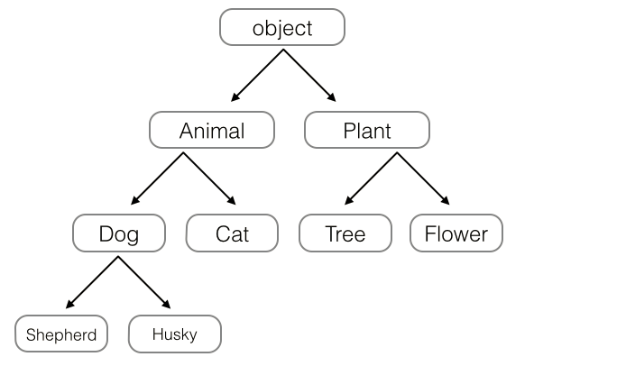

# 面向对象编程

** 面向对象编程——Object Oriented Programming，简称OOP，是一种程序设计思想。OOP把对象作为程序的基本单元，一个对象包含了数据和操作数据的函数。**

面向过程的程序设计把计算机程序视为一系列的命令集合，即一组函数的顺序执行。为了简化程序设计，面向过程把函数继续切分为子函数，即把大块函数通过切割成小块函数来降低系统的复杂度。

而面向对象的程序设计把计算机程序视为一组对象的集合，而每个对象都可以接收其他对象发过来的消息，并处理这些消息，计算机程序的执行就是一系列消息在各个对象之间传递。

在Python中，所有数据类型都可以视为对象，当然也可以自定义对象。自定义的对象数据类型就是面向对象中的类（Class）的概念。

我们以一个例子来说明面向过程和面向对象在程序流程上的不同之处。

假设我们要处理学生的成绩表，为了表示一个学生的成绩，面向过程的程序可以用一个dict表示：
```python
std1 = { 'name': 'Michael', 'score': 98 }
std2 = { 'name': 'Bob', 'score': 81 }```
而处理学生成绩可以通过函数实现，比如打印学生的成绩：
```python
def print_score(std):
    print('%s: %s' % (std['name'], std['score']))```
如果采用面向对象的程序设计思想，我们首选思考的不是程序的执行流程，而是Student这种数据类型应该被视为一个对象，这个对象拥有name和score这两个属性（Property）。如果要打印一个学生的成绩，首先必须创建出这个学生对应的对象，然后，给对象发一个print_score消息，让对象自己把自己的数据打印出来。
```python
class Student(object):

    def __init__(self, name, score):
        self.name = name
        self.score = score

    def print_score(self):
        print('%s: %s' % (self.name, self.score))```
给对象发消息实际上就是调用对象对应的关联函数，我们称之为对象的方法（Method）。面向对象的程序写出来就像这样：
```python
bart = Student('Bart Simpson', 59)
lisa = Student('Lisa Simpson', 87)
bart.print_score()
lisa.print_score()```
面向对象的设计思想是从自然界中来的，因为在自然界中，类（Class）和实例（Instance）的概念是很自然的。Class是一种抽象概念，比如我们定义的Class——Student，是指学生这个概念，而实例（Instance）则是一个个具体的Student，比如，Bart Simpson和Lisa Simpson是两个具体的Student。

所以，面向对象的设计思想是抽象出Class，根据Class创建Instance。

面向对象的抽象程度又比函数要高，因为一个Class既包含数据，又包含操作数据的方法。

# 类和实例


面向对象最重要的概念就是类（Class）和实例（Instance），必须牢记类是抽象的模板，比如Student类，而实例是根据类创建出来的一个个具体的“对象”，每个对象都拥有相同的方法，但各自的数据可能不同。

仍以Student类为例，在Python中，定义类是通过class关键字：
```python
class Student(object):
    pass```
class后面紧接着是类名，即Student，类名通常是大写开头的单词，紧接着是(object)，表示该类是从哪个类继承下来的，继承的概念我们后面再讲，通常，如果没有合适的继承类，就使用object类，这是所有类最终都会继承的类。

定义好了Student类，就可以根据Student类创建出Student的实例，创建实例是通过类名+()实现的：
```python
>>> bart = Student()
>>> bart
<__main__.Student object at 0x10a67a590>
>>> Student
<class '__main__.Student'>```
可以看到，变量bart指向的就是一个Student的实例，后面的0x10a67a590是内存地址，每个object的地址都不一样，而Student本身则是一个类。

可以自由地给一个实例变量绑定属性，比如，给实例bart绑定一个name属性：
```python
>>> bart.name = 'Bart Simpson'
>>> bart.name
'Bart Simpson'```
由于类可以起到模板的作用，因此，可以在创建实例的时候，把一些我们认为必须绑定的属性强制填写进去。通过定义一个特殊的__init__方法，在创建实例的时候，就把name，score等属性绑上去：
```python
class Student(object):

    def __init__(self, name, score):
        self.name = name
        self.score = score```
 注意：特殊方法“init”前后有两个下划线！！！
注意到__init__方法的第一个参数永远是self，表示创建的实例本身，因此，在__init__方法内部，就可以把各种属性绑定到self，因为self就指向创建的实例本身。

有了__init__方法，在创建实例的时候，就不能传入空的参数了，必须传入与__init__方法匹配的参数，但self不需要传，Python解释器自己会把实例变量传进去：
```python
>>> bart = Student('Bart Simpson', 59)
>>> bart.name
'Bart Simpson'
>>> bart.score
59```
和普通的函数相比，在类中定义的函数只有一点不同，就是第一个参数永远是实例变量self，并且，调用时，不用传递该参数。除此之外，类的方法和普通函数没有什么区别，所以，你仍然可以用默认参数、可变参数、关键字参数和命名关键字参数。

# 数据封装

面向对象编程的一个重要特点就是数据封装。在上面的Student类中，每个实例就拥有各自的name和score这些数据。我们可以通过函数来访问这些数据，比如打印一个学生的成绩：
```python
>>> def print_score(std):
...     print('%s: %s' % (std.name, std.score))
...
>>> print_score(bart)
Bart Simpson: 59```
但是，既然Student实例本身就拥有这些数据，要访问这些数据，就没有必要从外面的函数去访问，可以直接在Student类的内部定义访问数据的函数，这样，就把“数据”给封装起来了。这些封装数据的函数是和Student类本身是关联起来的，我们称之为类的方法：
```python
class Student(object):

    def __init__(self, name, score):
        self.name = name
        self.score = score

    def print_score(self):
        print('%s: %s' % (self.name, self.score))```
要定义一个方法，除了第一个参数是self外，其他和普通函数一样。要调用一个方法，只需要在实例变量上直接调用，除了self不用传递，其他参数正常传入：
```python
>>> bart.print_score()
Bart Simpson: 59```
这样一来，我们从外部看Student类，就只需要知道，创建实例需要给出name和score，而如何打印，都是在Student类的内部定义的，这些数据和逻辑被“封装”起来了，调用很容易，但却不用知道内部实现的细节。

封装的另一个好处是可以给Student类增加新的方法，比如get_grade：
```python
class Student(object):
    ...

    def get_grade(self):
        if self.score >= 90:
            return 'A'
        elif self.score >= 60:
            return 'B'
        else:
            return 'C'```
同样的，get_grade方法可以直接在实例变量上调用，不需要知道内部实现细节：
```python
>>> bart.get_grade()
'C'```
小结

类是创建实例的模板，而实例则是一个一个具体的对象，各个实例拥有的数据都互相独立，互不影响；

方法就是与实例绑定的函数，和普通函数不同，方法可以直接访问实例的数据；

通过在实例上调用方法，我们就直接操作了对象内部的数据，但无需知道方法内部的实现细节。

和静态语言不同，Python允许对实例变量绑定任何数据，也就是说，对于两个实例变量，虽然它们都是同一个类的不同实例，但拥有的变量名称都可能不同：
```python
>>> bart = Student('Bart Simpson', 59)
>>> lisa = Student('Lisa Simpson', 87)
>>> bart.age = 8
>>> bart.age
8
>>> lisa.age
Traceback (most recent call last):
  File "<stdin>", line 1, in <module>
AttributeError: 'Student' object has no attribute 'age'```


# 访问限制


在Class内部，可以有属性和方法，而外部代码可以通过直接调用实例变量的方法来操作数据，这样，就隐藏了内部的复杂逻辑。

但是，从前面Student类的定义来看，外部代码还是可以自由地修改一个实例的name、score属性：
```python
>>> bart = Student('Bart Simpson', 98)
>>> bart.score
98
>>> bart.score = 59
>>> bart.score
59
```
如果要让内部属性不被外部访问，可以把属性的名称前加上两个下划线__，在Python中，实例的变量名如果以__开头，就变成了一个私有变量（private），只有内部可以访问，外部不能访问，所以，我们把Student类改一改：
```python
class Student(object):

    def __init__(self, name, score):
        self.__name = name
        self.__score = score

    def print_score(self):
        print('%s: %s' % (self.__name, self.__score))```
改完后，对于外部代码来说，没什么变动，但是已经无法从外部访问实例变量.__name和实例变量.__score了：
```python
>>> bart = Student('Bart Simpson', 98)
>>> bart.__name
Traceback (most recent call last):
  File "<stdin>", line 1, in <module>
AttributeError: 'Student' object has no attribute '__name'```
这样就确保了外部代码不能随意修改对象内部的状态，这样通过访问限制的保护，代码更加健壮。

但是如果外部代码要获取name和score怎么办？可以给Student类增加get_name和get_score这样的方法：
```python
class Student(object):
    ...

    def get_name(self):
        return self.__name

    def get_score(self):
        return self.__score```
如果又要允许外部代码修改score怎么办？可以再给Student类增加set_score方法：
```python
class Student(object):
    ...

    def set_score(self, score):
        self.__score = score```
你也许会问，原先那种直接通过bart.score = 59也可以修改啊，为什么要定义一个方法大费周折？因为在方法中，可以对参数做检查，避免传入无效的参数：
```python
class Student(object):
    ...

    def set_score(self, score):
        if 0 <= score <= 100:
            self.__score = score
        else:
            raise ValueError('bad score')```
需要注意的是，在Python中，变量名类似__xxx__的，也就是以双下划线开头，并且以双下划线结尾的，是特殊变量，特殊变量是可以直接访问的，不是private变量，所以，不能用__name__、__score__这样的变量名。

有些时候，你会看到以一个下划线开头的实例变量名，比如_name，这样的实例变量外部是可以访问的，但是，按照约定俗成的规定，当你看到这样的变量时，意思就是，“虽然我可以被访问，但是，请把我视为私有变量，不要随意访问”。

双下划线开头的实例变量是不是一定不能从外部访问呢？其实也不是。不能直接访问__name是因为Python解释器对外把__name变量改成了_Student__name，所以，仍然可以通过_Student__name来访问__name变量：
```python
>>> bart._Student__name
'Bart Simpson'```
但是强烈建议你不要这么干，因为不同版本的Python解释器可能会把__name改成不同的变量名。

总的来说就是，Python本身没有任何机制阻止你干坏事，一切全靠自觉。

最后注意下面的这种错误写法：
```python
>>> bart = Student('Bart Simpson', 98)
>>> bart.get_name()
'Bart Simpson'
>>> bart.__name = 'New Name' # 设置__name变量！
>>> bart.__name
'New Name'```
表面上看，外部代码“成功”地设置了__name变量，但实际上这个__name变量和class内部的__name变量不是一个变量！内部的__name变量已经被Python解释器自动改成了_Student__name，而外部代码给bart新增了一个__name变量。不信试试：
```python
>>> bart.get_name() # get_name()内部返回self.__name
'Bart Simpson'```


# 继承和多态
## 继承
　在OOP（Object Oriented Programming）程序设计中，当我们定义一个class的时候，可以从某个现有的class 继承，新的class称为子类（Subclass），而被继承的class称为基类、父类或超类（Base class、Super class）。

* 我们先来定义一个class Person，表示人，定义属性变量 name 及 sex （姓名和性别）；

* 定义一个方法print_title()：当sex是male时，print man；当sex 是female时，print woman。参考如下代码：


```python
class Person(object):
    def __init__(self,name,sex):
        self.name = name
        self.sex = sex
        
    def print_title(self):
        if self.sex == "male":
            print("man")
        elif self.sex == "female":
            print("woman")

class Child(Person):                            # Child 继承 Person
    pass
            
May = Child("May","female")
Peter = Person("Peter","male")

print(May.name,May.sex,Peter.name,Peter.sex)    # 子类继承父类方法及属性
May.print_title()
Peter.print_title()
```

而我们编写 Child 类，完全可以继承 Person 类（Child 就是 Person）；使用 class subclass_name(baseclass_name) 来表示继承；

* 继承有什么好处？最大的好处是子类获得了父类的全部属性及功能。如下 Child 类就可以直接使用父类的 print_title() 方法

* 实例化Child的时候，子类继承了父类的构造函数，就需要提供父类Person要求的两个属性变量 name 及 sex：

* 在继承关系中，如果一个实例的数据类型是某个子类，那它也可以被看做是父类（May 既是 Child 又是 Person）。但是，反过来就不行（Peter 仅是 Person，而不是Child）。

* 继承还可以一级一级地继承下来，就好比从爷爷到爸爸、再到儿子这样的关系。而任何类，最终都可以追溯到根类object，这些继承关系看上去就像一颗倒着的树。比如如下的继承树： 

##isinstance()   及  issubclass()

Python 与其他语言不同点在于，当我们定义一个 class 的时候，我们实际上就定义了一种数据类型。我们定义的数据类型和Python自带的数据类型，比如str、list、dict没什么两样。

Python 有两个判断继承的函数：isinstance() 用于检查实例类型；issubclass() 用于检查类继承。参见下方示例：
```python
class Person(object):
    pass

class Child(Person):                 # Child 继承 Person
    pass

May = Child()
Peter = Person()    

print(isinstance(May,Child))         # True
print(isinstance(May,Person))        # True
print(isinstance(Peter,Child))       # False
print(isinstance(Peter,Person))      # True
print(issubclass(Child,Person))      # True
```
## 类的多态
在说明多态是什么之前，我们在 Child 类中重写 print_title() 方法：若为male，print boy；若为female，print girl
```python
class Person(object):
    def __init__(self,name,sex):
        self.name = name
        self.sex = sex
        
    def print_title(self):
        if self.sex == "male":
            print("man")
        elif self.sex == "female":
            print("woman")

class Child(Person):                # Child 继承 Person
    def print_title(self):
        if self.sex == "male":
            print("boy")
        elif self.sex == "female":
            print("girl")
        
May = Child("May","female")
Peter = Person("Peter","male")

print(May.name,May.sex,Peter.name,Peter.sex)
May.print_title()
Peter.print_title()
```
当子类和父类都存在相同的 print_title()方法时，子类的 print_title() 覆盖了父类的 print_title()，在代码运行时，会调用子类的 print_title()

　　　　这样，我们就获得了继承的另一个好处：**多态。** 

　　　　多态的好处就是，当我们需要传入更多的子类，例如新增 Teenagers、Grownups 等时，我们只需要继承 Person 类型就可以了，而print_title()方法既可以直不重写（即使用Person的），也可以重写一个特有的。这就是多态的意思。调用方只管调用，不管细节，而当我们新增一种Person的子类时，只要确保新方法编写正确，而不用管原来的代码。这就是著名的“开闭”原则：

  *  对扩展开放（Open for extension）：允许子类重写方法函数
  * 对修改封闭（Closed for modification）：不重写，直接继承父类方法函数
  
##子类重写构造函数

 　　　　子类可以没有构造函数，表示同父类构造一致；子类也可重写构造函数；现在，我们需要在子类 Child 中新增两个属性变量：mother 和 father，我们可以构造如下（建议子类调用父类的构造方法，参见后续代码）：
```python
class Person(object):
    def __init__(self,name,sex):
    self.name = name
    self.sex = sex

class Child(Person):                # Child 继承 Person
    def __init__(self,name,sex,mother,father):
        self.name = name
        self.sex = sex
        self.mother = mother
        self.father = father

May = Child("May","female","April","June")
print(May.name,May.sex,May.mother,May.father)    

Person
```
若父类构造函数包含很多属性，子类仅需新增1、2个，会有不少冗余的代码，这边，子类可对父类的构造方法进行调用，参考如下：
```python
class Person(object):
    def __init__(self,name,sex):
        self.name = name
        self.sex = sex

class Child(Person):                          # Child 继承 Person
    def __init__(self,name,sex,mother,father):
        Person.__init__(self,name,sex)        # 子类对父类的构造方法的调用
        self.mother = mother
        self.father = father

May = Child("May","female","April","June")
print(May.name,May.sex,May.mother,May.father)
```
##　多重继承

　　　　多重继承的概念应该比较好理解，比如现在需要新建一个类 baby 继承 Child ， 可继承父类及父类上层类的属性及方法，优先使用层类近的方法，代码参考如下：
```python
class Person(object):
    def __init__(self,name,sex):
        self.name = name
        self.sex = sex
        
    def print_title(self):
        if self.sex == "male":
            print("man")
        elif self.sex == "female":
            print("woman")
            
class Child(Person):
    pass

class Baby(Child):
    pass

May = Baby("May","female")        # 继承上上层父类的属性
print(May.name,May.sex)            
May.print_title()                 # 可使用上上层父类的方法


class Child(Person):                
    def print_title(self):
        if self.sex == "male":
            print("boy")
        elif self.sex == "female":
            print("girl")
            
class Baby(Child):
    pass
            
May = Baby("May","female")
May.print_title()                # 优先使用上层类的方法
```


